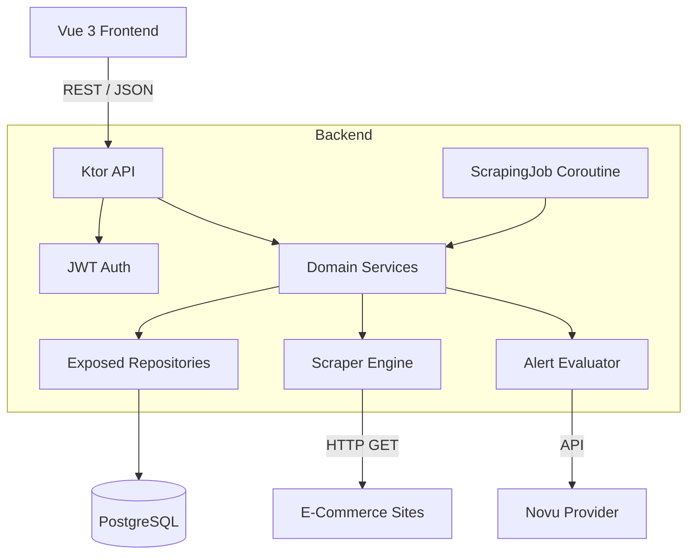
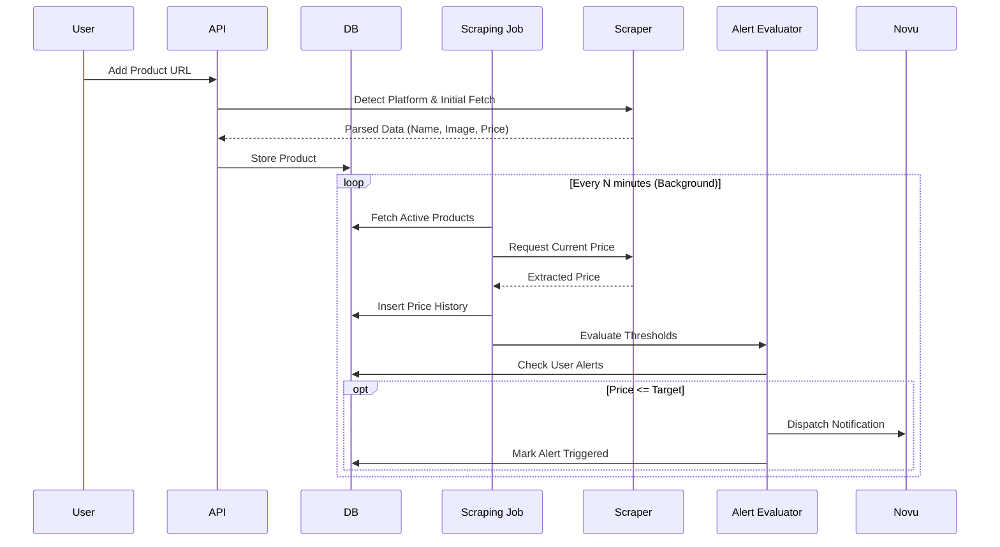
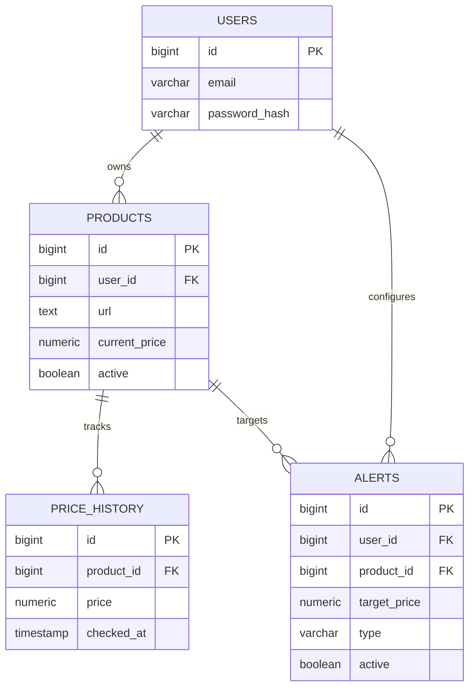
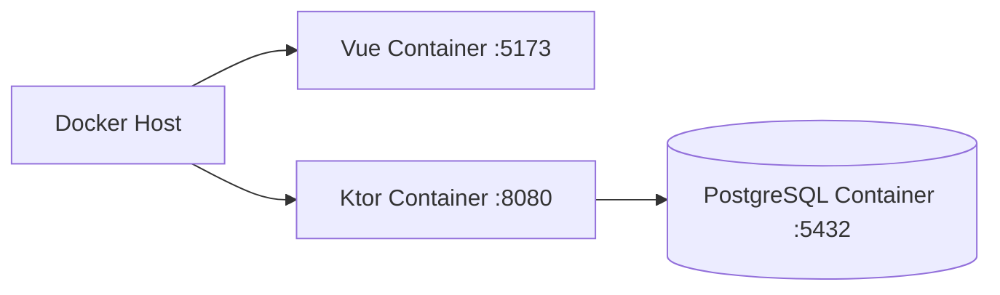

# PriceWatch
> Price Intelligence & Automated Monitoring Platform

PriceWatch is a self-hosted, full-stack price intelligence platform designed to automate the tracking of product prices across e-commerce platforms. Built with a robust Kotlin/Ktor backend and a reactive Vue 3 frontend, it provides scheduled scraping, historical price charting, and real-time alert evaluation.


---

## Features

- **Automated Data Collection:** Scheduled background jobs using Kotlin Coroutines for non-blocking scraping.
- **Price History Tracking:** Persistent historical data visualized through dynamic charts.
- **Alert Evaluation:** Real-time threshold evaluation to trigger notifications when a price drops below a configured target.
- **Pluggable Scraper Architecture:** Abstracted scraper engine currently supporting Mercado Livre, designed for easy extension.
- **Multi-Channel Notifications:** Integrated with Novu for reliable delivery of price alerts.
- **Secure Authentication:** JWT-based stateless authentication with password hashing (BCrypt).

## Tech Stack

| Layer | Technology | Purpose |
|---|---|---|
| **Backend** | Kotlin + Ktor | High-performance, asynchronous REST API |
| **Database** | PostgreSQL | Relational persistent storage |
| **ORM & Migrations** | Exposed + Flyway | Type-safe SQL DSL and schema versioning |
| **Scraping** | SkrapeIt + Jsoup | HTML parsing and DOM traversal |
| **Frontend** | Vue 3 + TypeScript | Reactive single-page application |
| **Visualization** | Chart.js | Historical data visualization |
| **Infrastructure** | Docker + Docker Compose | Containerized local environment |

## Architecture

PriceWatch uses a clear separation of concerns, decoupling the presentation layer (REST API), domain logic, background processing, and infrastructure integrations.

- **Presentation Layer (Ktor Routing):** Handles HTTP requests, content negotiation, and JWT authentication.
- **Domain Layer:** Contains the core business logic, including `PriceTrackingService` and `AlertEvaluator`.
- **Background Processing:** A lightweight `ScrapingJob` built on Kotlin Coroutines orchestrates periodic polling independently of API traffic.
- **Infrastructure Layer:** Abstracts external dependencies, providing `ProductRepository`, `PriceHistoryRepository`, `PriceScraper` interfaces, and a `Notifier` abstraction (implemented via Novu).



## System Data Flow

The lifecycle of a monitored product relies on asynchronous processing to ensure the API remains responsive.



## Data Model

The database schema is managed via Flyway migrations and represents a relational structure optimized for fast timeseries queries.


*Indexes are applied on foreign keys and compound timestamp queries to optimize the scraping job and history retrieval.*

## API

The application exposes a RESTful API. Most endpoints require a valid JWT `Authorization: Bearer <token>` header.

| Method | Endpoint | Description | Auth |
|---|---|---|---|
| `POST` | `/auth/register` | Create a new user account | No |
| `POST` | `/auth/login` | Authenticate and obtain JWT | No |
| `GET` | `/products` | List user's tracked products | Yes |
| `POST` | `/products` | Register a new product URL | Yes |
| `PUT` | `/products/{id}` | Update product details | Yes |
| `DELETE`| `/products/{id}` | Remove a product | Yes |
| `GET` | `/scraping/{id}/history`| Retrieve historical price data | Yes |
| `POST` | `/alerts` | Create a price alert | Yes |
| `GET` | `/alerts` | List configured alerts | Yes |

## Scraping Engine

The scraping module is designed with an interface-driven approach (`PriceScraper`), allowing easy extension for new marketplaces.

- **Current Implementation:** Mercado Livre.
- **Mechanism:** Fetches raw HTML and uses **SkrapeIt** and **Jsoup** for DOM traversal.
- **Robustness:** Handles missing nodes, dynamic CSS selectors variations, and validates parsed currencies and stock statuses before persisting.

## Notifications

Alerts are decoupled from the core domain via a `Notifier` interface. The current implementation utilizes **Novu** to orchestrate multi-channel delivery (Email, Push, In-App) based on a configured workflow (`price-alert`).

## Security

- **Authentication:** Stateless JWT tokens signed with a symmetric secret.
- **Password Storage:** BCrypt hashing with auto-generated salts.
- **Data Isolation:** Repository layer strictly enforces ownership constraints (e.g., users can only query/modify their own products).
- **CORS:** Configurable allowed origins via environment variables.
- **Validation:** Strict payload validation for URLs, currencies, and numeric precision.

## Project Structure

```text
.
├── backend/
│   ├── src/main/kotlin/com/example/app/
│   │   ├── alert/         # Notification and evaluation logic
│   │   ├── auth/          # JWT and BCrypt security
│   │   ├── db/            # Exposed tables and mappings
│   │   ├── product/       # Product routes and models
│   │   ├── repository/    # Data access layer
│   │   └── scraping/      # Scrapers and background job
│   └── src/main/resources/db/migration/ # Flyway SQL
├── frontend/
│   ├── src/
│   │   ├── api/           # Axios wrappers
│   │   ├── components/    # Vue UI components
│   │   ├── stores/        # Pinia state management
│   │   ├── views/         # Page components
│   │   └── styles.css     # Custom dark theme system
└── docker-compose.yml
```

## Getting Started

### Requirements
- Docker and Docker Compose

### Installation

1. **Clone the repository:**
   ```bash
   git clone <repository-url>
   cd projeto-mvp
   ```

2. **Configure environment variables:**
   Copy the example file and adjust if necessary:
   ```bash
   cp .env.example .env
   ```

3. **Start the containers:**
   The Docker Compose configuration will build the backend and frontend, and provision the PostgreSQL database.
   ```bash
   docker compose up --build
   ```

### Accessing the Application
- **Frontend:** `http://localhost:5173`
- **Backend API:** `http://localhost:8080`

## Environment Variables

| Variable | Required | Description |
|---|---|---|
| `POSTGRES_DB` | Yes | Database name |
| `POSTGRES_USER` | Yes | Database user |
| `POSTGRES_PASSWORD` | Yes | Database password |
| `JWT_SECRET` | Yes | Secret for signing JWTs |
| `JWT_ISSUER` | Yes | JWT issuer claim |
| `JWT_AUDIENCE` | Yes | JWT audience claim |
| `SCRAPER_JOB_ENABLED` | No | Enables background scraping (`true`/`false`) |
| `SCRAPER_INTERVAL_MINUTES`| No | Scraping frequency (default: 60) |
| `NOVU_API_KEY` | No | API key for notifications |
| `VITE_API_URL` | Yes | API URL for the frontend |

## Deployment

The system is fully containerized. The `docker-compose.yml` provides a declarative infrastructure definition:


*Note: The current Docker Compose setup is optimized for local development. For production, consider using managed PostgreSQL and adding a reverse proxy (e.g., NGINX or Traefik).*

## Engineering Decisions

- **Kotlin & Ktor:** Chosen for strong typing, exceptional performance, and native coroutine support which simplifies the asynchronous scraping background job without needing an external queueing system like Celery or RabbitMQ.
- **Exposed ORM:** Provides a type-safe SQL DSL in Kotlin, preventing SQL injection and offering compile-time safety over raw SQL strings.
- **Abstracted Notifications:** By hiding Novu behind a `Notifier` interface, the system can easily swap notification providers (e.g., AWS SNS, SendGrid) without changing business logic.

## Engineering Challenges

- **External Website Variability:** E-commerce DOM structures change frequently. The scraper relies on robust, fail-safe parsing that degrades gracefully (e.g., marking a product as inactive or retaining the last known price) rather than crashing the job.
- **Scheduled Processing Concurrency:** The `ScrapingJob` runs on a dedicated coroutine dispatcher, ensuring that network I/O during HTML fetching does not block the main Netty threads serving API requests.
- **Historical Data Consistency:** Scraping jobs record a snapshot in `price_history` only when successful, ensuring the timeseries charts in the frontend remain accurate even if temporary network failures occur.

## Roadmap

### Completed
- Core architecture and API foundations
- JWT Authentication
- Product management and Mercado Livre integration
- Background scraping job using Coroutines
- Price history tracking and visualization
- Alerts engine and Novu integration
- Docker containerization

### Planned
- Add support for Amazon and other major retailers
- Implement a proxy rotation system for the scraper to avoid rate limits
- Add OAuth2 (Google/GitHub) authentication
- Implement WebSocket support for real-time frontend updates

## Contributing

1. Fork the repository
2. Create a feature branch (`git checkout -b feature/amazing-feature`)
3. Commit your changes (`git commit -m 'Add amazing feature'`)
4. Push to the branch (`git push origin feature/amazing-feature`)
5. Open a Pull Request

## License

License information has not yet been specified.
